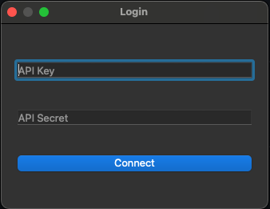
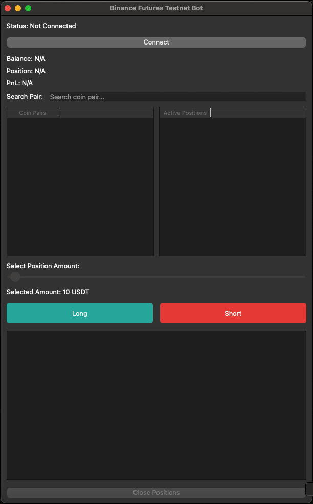
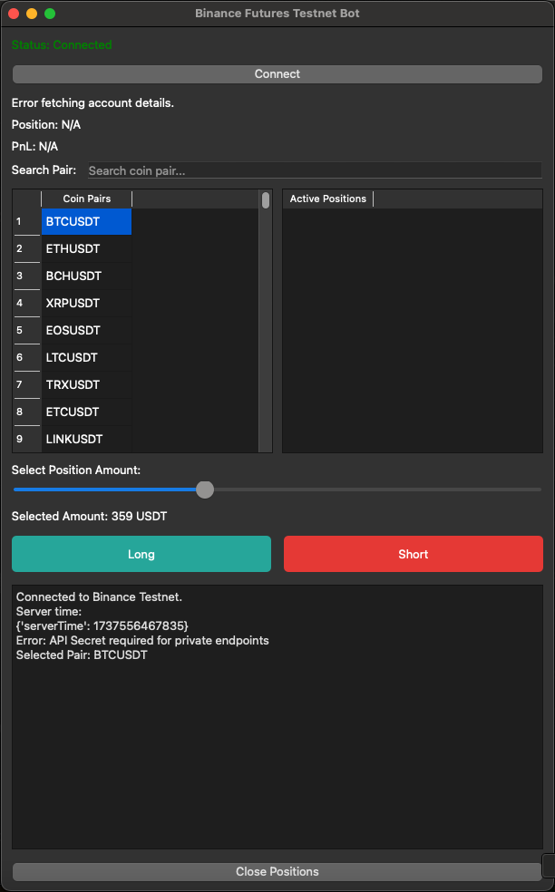

# Binance Buy-Sell App


## Overview
The Binance Buy-Sell App is a simple trading application built using Python and PyQt5. It interacts with the Binance Futures API, allowing users to:

- View and search for trading pairs.
- Place **Buy** or **Sell** orders.
- Monitor account balances, active positions, and PnL.

### **Special Feature**
This app performs the opposite action of the selected button:
- Clicking "Buy" executes a **Sell** order.
- Clicking "Sell" executes a **Buy** order.

## Features
- **User Authentication:** Secure login with Binance API keys.
- **Trading Pair Search:** Easy filtering of trading pairs.
- **Position Management:** Open and close positions with ease.
- **Customizable Amounts:** Adjustable trade amounts using a slider.
- **Real-Time Data:** Displays account balance, open positions, and unrealized PnL.

## Screenshots
Below are some screenshots showcasing the app:

### Login Screen


### Main Dashboard


### Trading Pair Search


## Installation
### Prerequisites
- Python 3.8 or above
- Binance API keys (Testnet or Mainnet)

### Required Libraries
Install the dependencies using pip:
```bash
pip install PyQt5 python-binance
```

### Running the App
1. Clone this repository:
   ```bash
   git clone https://github.com/yourusername/binance-buy-sell-app.git
   cd binance-buy-sell-app
   ```
2. Run the application:
   ```bash
   python main.py
   ```
3. Enter your Binance API credentials to connect and start trading.

## Usage
1. Login with your Binance API Key and Secret.
2. Use the search bar to filter trading pairs.
3. Adjust the trade amount using the slider.
4. Select a trading pair and click **Buy** or **Sell** (actions will be reversed).
5. Monitor your balance, open positions, and PnL in real-time.
6. Close positions easily using the "Close Positions" button.

## Notes
- The app uses Binance Testnet by default. Make sure your API keys are configured for Testnet.
- Ensure you have sufficient balance in your Binance Futures wallet.

## Video Tutorial
For a step-by-step guide, watch the tutorial on [YouTube](https://www.youtube.com/embed/D07W888vT-c).

## License
This project is licensed under the MIT License.

## Contributing
Contributions are welcome! Feel free to open issues or submit pull requests.

